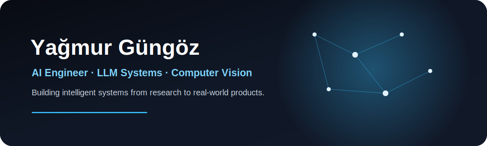
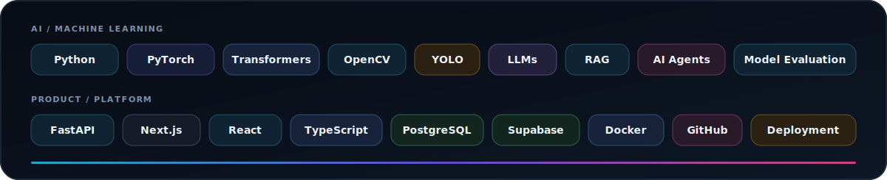
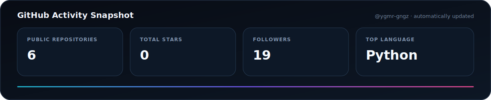

<picture>
  <source
    media="(prefers-color-scheme: dark)"
    srcset="./assets/header-dark.svg"
  >
  <source
    media="(prefers-color-scheme: light)"
    srcset="./assets/header-light.svg"
  >
  
</picture>

 

  <a href="https://www.linkedin.com/in/ya%C4%9Fmur-g%C3%BCng%C3%B6z/">
    LinkedIn
  </a>
  &nbsp;·&nbsp;
  <a href="mailto:yagmurgungoz@gmail.com">
    E-posta
  </a>
  &nbsp;·&nbsp;
  <a href="https://github.com/ygmr-gngz">
    GitHub
  </a>
  &nbsp;·&nbsp;
  İstanbul, Türkiye

  <strong>
    Gerçek dünya problemlerini çözen, üretime hazır yapay zekâ sistemleri geliştiriyorum.
  </strong>

## Ne geliştiriyorum?

<table>
<tr>
<td width="50%" valign="top">

### AdimOS

Muhasebe danışmanlığı ve eğitim süreçlerini tek panelde birleştiren çok ajanlı yapay zekâ sistemi.

**Sistem bileşenleri**

- RAG tabanlı bilgi asistanı
- Sesli yapay zekâ deneyimi
- Otomatik video ve içerik üretimi
- CRM ve takip otomasyonları
- Ajanlar arası görev yönetimi
- Doküman indeksleme ve bilgi merkezi
- Eğitim ve soru çözüm içerikleri

`Next.js` `FastAPI` `Supabase` `OpenAI` `PostgreSQL` `pgvector`

</td>

<td width="50%" valign="top">

### AI Product Engineering

Yapay zekâ modellerini yalnızca demo seviyesinde bırakmayıp API, kullanıcı arayüzü, veri tabanı ve deployment katmanlarıyla çalışan ürünlere dönüştürüyorum.

**Odak alanlarım**

- LLM ve RAG mimarileri
- Multi-agent sistemler
- FastAPI tabanlı servisler
- Modern web arayüzleri
- Veri tabanı ve vektör arama entegrasyonları
- Yapay zekâ destekli içerik otomasyonları
- Deployment ve sistem gözlemleme

`Python` `FastAPI` `Next.js` `OpenAI` `PostgreSQL` `Docker`

</td>
</tr>
</table>

## Teknoloji Alanlarım

## Sistem Terminali

## GitHub Özeti

